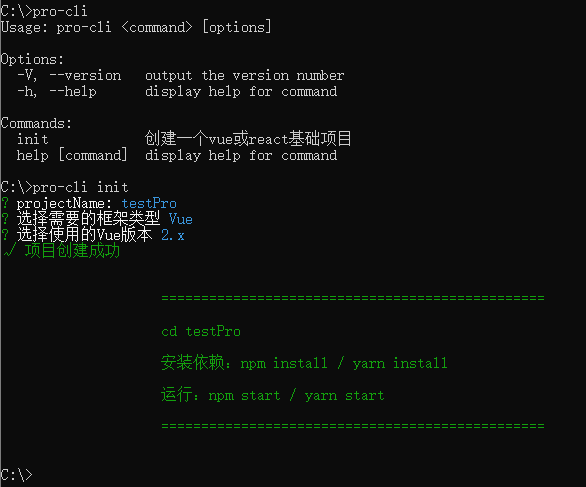

## 使用说明
> 本想用pro-cli作为包名的，无奈npmjs.com上已经有重名的，所以不得已在前面加k

**实现了下载自定义的 Vue(2.x  3.x ) 和 React 基本项目模板功能**

自定义的vue及react基础模板github地址：
1. [vue2基础模板](https://github.com/viprosite/template-vue-2)
2. [vue3基础模板](https://github.com/viprosite/template-vue-3)
3. [react基础模板](https://github.com/viprosite/template-react)

使用了`commander`、`inquirer`、`chalk`、`ora`、`downloadGIt` 几大必备命令行常用工具

安装：`npm i -g kpro-cli`

使用：`pro-cli init`

