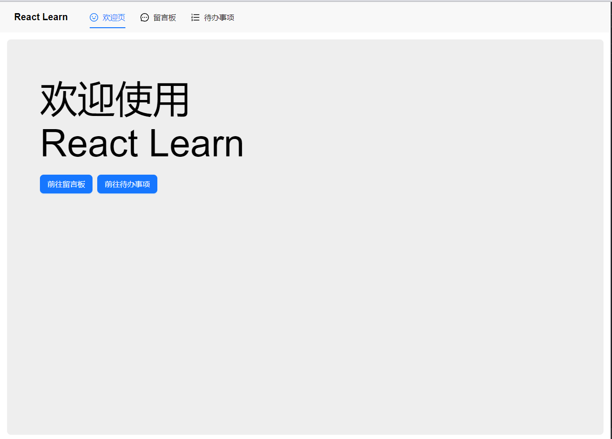
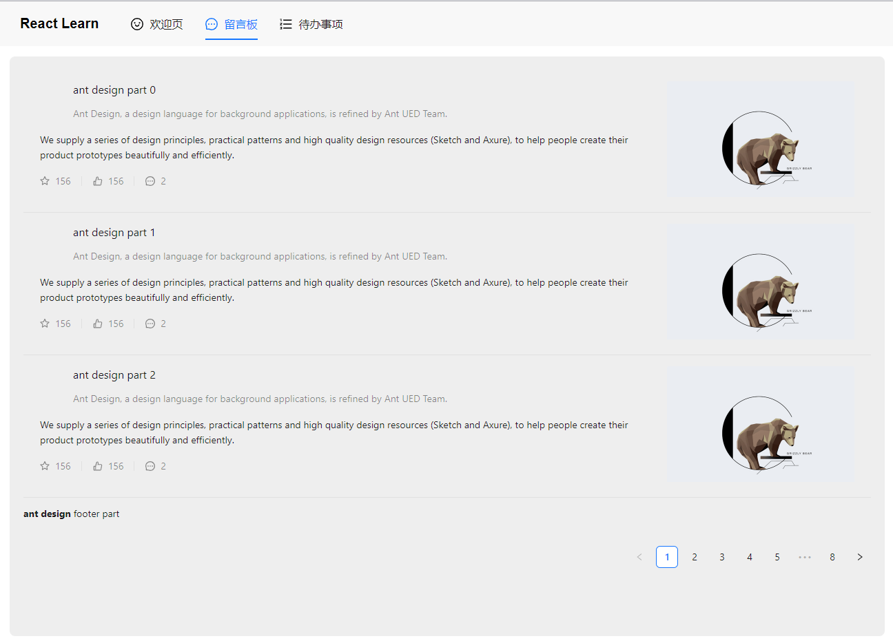
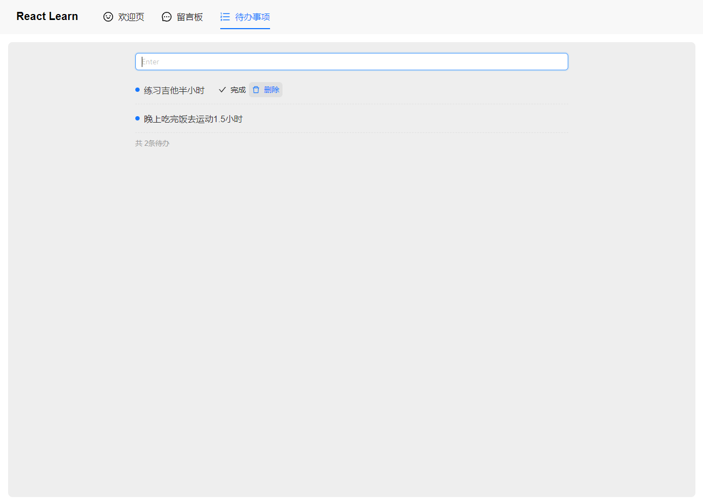

## 技术栈
1. react 18
2. react-router-dom
3. redux  react-redux
4. ant design UI库
   
> useLoaction
> useNavigate








## @reduxjs/toolkit 使用
 **dispatch(add(xxx))  xxx就是作为固定payload的属性值
    {type:'add', payload:xxx}**
```javascript
store/ 
1. > modules/todo.js：
import { createSlice } from "@reduxjs/toolkit";
const todoSlice = createSlice({
    name,
    initialState:{
        todoList:[]
    },
    reducers:{
        add(state, action){},

    }
})
const todo = todoSlice.reducer
/**
console.log(todoSlice);
actions:{ add: ƒ, edit: ƒ, remove: ƒ }
caseReducers:{ add: ƒ, edit: ƒ, remove: ƒ }
getInitialState:ƒ()
name:"todo"
reducer:ƒ(state, action)
 */
==================================================
2. > store/index.js：
import { configureStore } from "@reduxjs/toolkit";
const store = configureStore({
    reducer: {
        todo
    }
})
export default store
================================================
> App.jsx：
import store from '@/store'
import { Provider } from 'react-redux';
export default function App() {
   return (
      <React.StrictMode>
         <Provider store={store}>
            <RouterProvider router={router}></RouterProvider>
         </Provider>
      </React.StrictMode>
   )
================================
> 其他组件：
import { useSelector, useDispatch } from "react-redux"
import { add, edit, remove, finish } from '@/store/modules/todo'
const todoList = useSelector(state => state.todo.todoList)
let dispatch = useDispatch()

const handleInputEnter = () => {
    dispatch(add(inputTodo))  // => {type:'todo/add', payload: inputTodo}